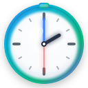

# 🕐 Chrome Overlay Timer

현대적이고 아름다운 디자인의 Chrome 확장 프로그램으로, 모든 웹페이지 위에 오버레이 타이머를 표시합니다.



## ✨ 주요 기능

- **🎨 현대적 디자인**: 세련된 그라디언트와 애니메이션 효과
- **📱 드래그 앤 드롭**: 타이머를 원하는 위치로 자유롭게 이동
- **🔧 리사이즈 가능**: 모서리를 드래그하여 크기 조절
- **⏰ 정확한 시간 측정**: 시:분:초 형식으로 정밀한 시간 표시
- **🔄 스마트 버튼**: 실행 중일 때는 초기화 버튼이 자동으로 숨겨짐
- **💾 상태 저장**: 위치, 크기, 타이머 상태가 자동으로 저장됨
- **🌐 모든 사이트 지원**: 제한된 페이지를 제외한 모든 웹사이트에서 동작

## 🚀 설치 방법

### Chrome 웹 스토어에서 설치 (권장)

1. Chrome 웹 스토어에서 "Overlay Timer" 검색
2. "Chrome에 추가" 버튼 클릭
3. 확장 프로그램 아이콘을 클릭하여 타이머 활성화

### 개발자 모드로 설치

1. 이 저장소를 클론하거나 다운로드
   ```bash
   git clone https://github.com/msm0748/chrome-web-store-timer
   ```
2. Chrome에서 `chrome://extensions/` 페이지 열기
3. 우상단의 "개발자 모드" 토글 활성화
4. "압축해제된 확장 프로그램을 로드합니다" 클릭
5. 다운로드한 폴더 선택

## 🎯 사용 방법

### 기본 사용법

1. **타이머 표시/숨기기**: 확장 프로그램 아이콘 클릭
2. **타이머 시작**: "시작" 버튼 클릭
3. **타이머 일시정지**: "멈춤" 버튼 클릭
4. **타이머 초기화**: "초기화" 버튼 클릭 (멈춤 상태에서만 표시)

### 고급 기능

- **위치 이동**: 제목 바를 드래그하여 타이머 이동
- **크기 조절**: 우하단 모서리를 드래그하여 크기 조절
- **최소 크기**: 버튼이 잘리지 않도록 최소 크기 제한 (340x180px)

## 🛠️ 기술 스택

- **Manifest V3**: 최신 Chrome 확장 프로그램 API 사용
- **Vanilla JavaScript**: 프레임워크 없는 순수 자바스크립트
- **Shadow DOM**: 웹페이지 스타일과의 충돌 방지
- **CSS3**: 현대적인 그라디언트, 애니메이션, 블러 효과
- **Chrome Storage API**: 사용자 설정 및 상태 저장

## 📁 프로젝트 구조

```
chrome-web-store-timer/
├── manifest.json          # 확장 프로그램 설정
├── icons/                 # 아이콘 파일들
│   ├── icon-128.png      # PNG 아이콘 (128x128)
│   └── timer.svg         # SVG 아이콘 (원본)
├── scripts/              # 자바스크립트 파일들
│   ├── background.js     # 백그라운드 서비스 워커
│   └── content.js        # 컨텐츠 스크립트 (메인 로직)
├── README.md             # 프로젝트 설명서
└── LICENSE               # MIT 라이센스
```

## 🎨 디자인 특징

### 시각적 효과

- **글로우 애니메이션**: 전체 타이머에 부드러운 발광 효과
- **펄스 애니메이션**: 시간 표시 영역의 맥박 효과
- **시머 애니메이션**: 제목 바의 흐르는 빛 효과
- **호버 효과**: 버튼에 마우스 오버 시 빛나는 효과

### 색상 팔레트

- **메인 그라디언트**: 파란색 → 청록색 → 녹색 → 보라색
- **배경**: 반투명 다크 테마 (블러 효과)
- **텍스트**: 그라디언트 적용된 고대비 텍스트
- **버튼**: 상태별 색상 구분 (파란색: 시작, 빨간색: 초기화)

## ⚙️ 개발 정보

### 주요 함수들

- `updateButtonStates()`: 타이머 상태에 따른 버튼 가시성 제어
- `clampToViewport()`: 타이머가 화면 밖으로 나가지 않도록 제한
- `formatTime()`: 밀리초를 HH:MM:SS 형식으로 변환
- `saveState()` / `loadState()`: Chrome Storage API를 통한 상태 관리

### 이벤트 처리

- 드래그 이동: `mousedown`, `mousemove`, `mouseup` 이벤트
- 리사이즈: 우하단 핸들을 통한 크기 조절
- 메시지 통신: 백그라운드와 컨텐츠 스크립트 간 통신

## 🔒 권한 설명

- **`storage`**: 타이머 상태 및 사용자 설정 저장
- **`tabs`**: 활성 탭에서 타이머 토글 기능
- **`<all_urls>`**: 모든 웹사이트에서 타이머 표시 (제한된 페이지 제외)

## 🐛 알려진 제한사항

- `chrome://` 페이지에서는 동작하지 않음 (Chrome 보안 정책)
- Chrome 웹 스토어 페이지에서는 제한적으로 동작
- 일부 보안이 강화된 사이트에서는 동작하지 않을 수 있음

## 🤝 기여하기

1. 이 저장소를 포크
2. 새 브랜치 생성 (`git checkout -b feature/amazing-feature`)
3. 변경사항 커밋 (`git commit -m 'Add some amazing feature'`)
4. 브랜치에 푸시 (`git push origin feature/amazing-feature`)
5. Pull Request 생성

## 📝 라이센스

이 프로젝트는 [MIT 라이센스](LICENSE) 하에 배포됩니다.

## 🙏 감사의 말

- Chrome Extensions API 문서
- MDN Web Docs
- 모든 기여자들과 사용자들

---

**⭐ 이 프로젝트가 유용하다면 스타를 눌러주세요!**
